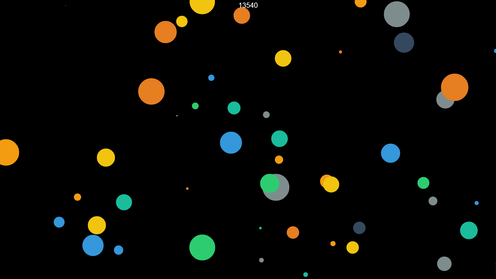

Ball Simulator 2015 - JavaScript Edition
==========
***Because I'm bored***

Made in one night with boredom, javascript, and HTML5.

Special thanks to Logan Engstrom for prettifying the colors.

How To Play
=============

Do you seriously not know how to play this sort of game? Whatever. WASD to move. Eat the smaller circles by touching them, and avoid the larger circles. Tell your friends! Compare high scores! And for the love of god don't realize this is a clone of the other 2000 circle games!

